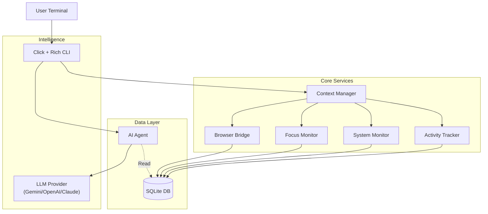

# 🕵️‍♂️ TraceCLI

> **The terminal's black box for your digital life.** 
> A privacy-first, AI-powered activity tracker and productivity coach that lives in your terminal.
>
> **Built with GitHub Copilot CLI** — [Read the Story](COPILOT.md)

[](LICENSE)
[](https://github.com/Haseeb-Arshad/trace-cli)

## ✨ Why TraceCLI?

TraceCLI isn't just a time tracker. It's an **intelligent agent** that monitors your digital habits, actively protects your focus, and gives you AI-powered coaching to improve your workflow.

- **🔒 Privacy First**: All data is stored locally in `~/.tracecli/trace.db`. No data leaves your machine unless you ask the AI.
- **🚀 Zero Friction**: Auto-starts with Windows. Tracks active windows, browser searches, and system resources automatically.
- **🧠 AI-Powered**: Chat with your productivity data using Natural Language. Get personalized insights and weekly digests.

---

## 🚀 Key Features

### 📊 Productivity Heatmap
Visualize your consistency with a GitHub-style contribution graph.
```bash
tracecli heatmap --weeks 52
```

### 🎯 Focus Mode
A Pomodoro timer with **active distraction detection**. If you switch to a non-productive app (e.g., social media), TraceCLI alerts you immediately.
```bash
tracecli focus --duration 25 --goal "Core Feature Implementation"
```

### 🧠 AI Insights
Get personalized productivity digests or ask questions about your habits using natural language.
```bash
tracecli insights  # Weekly coaching report
tracecli ask "What was my most used app on Monday?"
```

---

## 🛠️ Installation

```bash
# Clone the repository
git clone https://github.com/Haseeb-Arshad/trace-cli.git
cd trace-cli

# Install in editable mode
pip install -e .

# Verify installation
tracecli --version
```

### ⚙️ AI Configuration (Optional)
Supported providers: `gemini`, `openai`, `claude`.
```bash
tracecli config --provider gemini --key YOUR_API_KEY
```

---

## 🎮 Command Reference

### Core & Tracking
- `tracecli start`: Start activity tracking (use `--background` to run silently).
- `tracecli live`: View real-time activity feed.
- `tracecli status`: Check CLI and Database status.
- `tracecli autostart enable`: Enable start on Windows login.

### Analytics & Reports
- `tracecli stats`: View daily productivity summary.
- `tracecli heatmap`: GitHub-style productivity graph.
- `tracecli report`: Detailed daily report with app breakdowns.
- `tracecli timeline`: Visual daily timeline of activities.
- `tracecli app [NAME]`: Deep dive into a specific application's usage.

### System & Browsing
- `tracecli urls`: Browser history and domain breakdown.
- `tracecli searches`: Recent browser search queries.
- `tracecli system`: System resource overview (CPU/RAM snapshots).

---

## 📄 License

TraceCLI is released under the [MIT License](LICENSE).

---

## 🏗️ Architecture

TraceCLI is built on a modular architecture designed for performance and extensibility.



### Key Components
- **Tracker**: Polls `GetForegroundWindow` API to detect active apps.
- **Categorizer**: Maps process names/titles to categories (Dev, Social, Productivity) using regex rules.
- **FocusMonitor**: dedicated thread that enforces focus rules during sessions.
- **BrowserBridge**: Safely reads locked browser history databases (Chrome/Edge) to extract searches.

---

## 🤝 Contributing

We welcome contributions! Please see `CONTRIBUTING.md` for details.

## 📄 License

MIT License.
